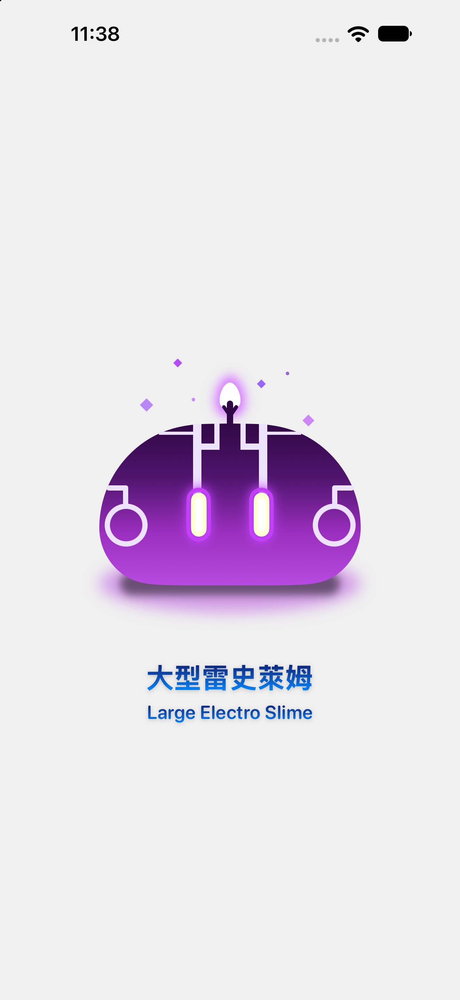

<a id="top"></a>

<div align="center">

# ⚡ Large Electro Slime (大型雷史萊姆)

**A 100% Pure SwiftUI Vector Graphics Recreation of Genshin Impact's Electro Slime**

[](https://swift.org)
[](https://developer.apple.com/xcode/swiftui/)
[](https://www.apple.com/ios/)
[](https://developer.apple.com/xcode/)
[](https://www.apple.com)
[](LICENSE)

<br />

### 🌐 Quick Navigation / 快速導覽
**[ 🇬🇧 English ](#english)** &nbsp;•&nbsp; **[ 🇹🇼 繁體中文 ](#繁體中文)**

<br />



<br />
<sub>⚡ Crafted with precision in SwiftUI • Zero external bitmap assets ⚡</sub>

</div>

---

<a id="english"></a>
<a id="-english"></a>
## 🇬🇧 English

<p align="right">
  <a href="#繁體中文">🇹🇼 Switch to 繁體中文</a>
</p>

### 📖 Introduction

**Large Electro Slime** is a fan-tribute SwiftUI project that recreates the iconic monster from the game *Genshin Impact* entirely using **declarative code**. 

Unlike conventional mobile apps relying on PNG or SVG assets, this artwork is rendered **100% programmatically** via SwiftUI vector primitives (`Path`, `UnevenRoundedRectangle`, `Capsule`, `Circle`, `Rectangle`) and custom cubic Bézier mathematics. Every detail—from the elemental lightning horn swirls to the radiant glowing eyes and atmospheric energy particles—is rendered in real time.

---

### 🌟 Key Features

- 🎨 **100% Pure SwiftUI Vector Graphics**: Zero image files or external dependencies. All visual elements are generated by iOS code at runtime.
- 📐 **Custom Cubic Bézier `EggShape`**: Features a custom-engineered `Shape` using 4-segment cubic Bézier curves (`addCurve`) with 65% height weighting to form an organic teardrop lightning bulb.
- ⚡ **Layered Neon Glow & Bloom**: Multi-pass Gaussian blurs (`.blur(radius:)`) and translucent opacity layering replicate the in-game Electro elemental illumination.
- 🔮 **Vibrant Electro Color Gradients**: Accurate vertical gradient transitions from midnight abyssal violet (`#300745`) to radiant electric lavender (`#B84AE0`).
- 💎 **Symmetric Horn Graphics**: Smart reuse of complex Electro coiled horn motifs using horizontal mirror transforms (`.scaleEffect(x: -1, y: 1)`).
- 📱 **Infinite Resolution**: Crisp, pixel-perfect rendering across all display scales and screen sizes (Retina, Super Retina XDR).

---

### 📸 Preview Showcase

| App Interface | Interactive Canvas |
| :---: | :---: |
|  |  |
| *Running on iPhone 18 Pro Max Simulator* | *SwiftUI Canvas `#Preview` Realtime Render* |

---

### 📐 Design & Anatomy Breakdown

The slime's morphology is stacked layer-by-layer inside a `ZStack`:

| Layer Component | SwiftUI Primitives & Shapes | Visual Technique |
| :--- | :--- | :--- |
| **Ground Shadow** | `Ellipse` & `Capsule` | Dual-tier shadow with purple ambient reflection + deep contact occlusion |
| **Slime Body** | `UnevenRoundedRectangle` | Asymmetric top (`115pt`) and bottom (`55pt`) corner radii with 4-stop `LinearGradient` |
| **Luminescent Bulb** | Custom `EggShape` & `Capsule` | 4-pass cubic Bézier curve, stem bract leaves, and white light emitter core |
| **Electro Forehead Crest** | `Rectangle` matrix | Geometric circuitry patterns aligned symmetrically with `HStack` |
| **Neon Eyes** | `Capsule` multi-ring layers | Outer neon glow + stroke outline + warm vanilla sclera + specular highlight |
| **Lightning Horns** | `Circle.stroke` + `Capsule` | Circular spiral horns horizontally mirrored with `.scaleEffect(x: -1, y: 1)` |
| **Energy Sparks** | Rotated `Rectangle` (45°) & `Circle` | Floating ambient diamond sparkles and elemental micro-particles |
| **Typography** | `Text` + Gradient Shader | Dual-language titles with gradient foreground style & drop shadows |

---

### 🎨 Color Palette & Element Specs

| Role | Color Preview | HEX / RGB | Description |
| :--- | :---: | :---: | :--- |
| **Abyssal Purple** |  | `rgb(48, 7, 69)` | Body top gradient / Horn stems |
| **Deep Violet** |  | `rgb(79, 20, 110)` | Body upper-mid transition tone |
| **Royal Violet** |  | `rgb(153, 46, 188)` | Core Electro elemental midtone |
| **Electric Lavender** |  | `rgb(184, 74, 224)` | Body base glow / Ground reflection |
| **Neon Glow** |  | `rgb(214, 120, 255)` | Eye neon rings & antenna bloom halo |
| **Pale Crest Silver** |  | `rgb(237, 227, 255)` | Forehead lightning circuitry & horns |
| **Warm Sclera** |  | `rgb(255, 255, 209)` | Inner eye glow & eyeball base |

---

### 🛠️ Tech Stack & Requirements

- **Framework**: SwiftUI (iOS 17.0+ / iOS 18.0+)
- **Language**: Swift 5.10 / Swift 6.0
- **IDE**: Xcode 16.0 or newer
- **Architectural Style**: Declarative UI, Component Composition, Pure Vector Rendering

---

### 🚀 Getting Started

1. **Clone the repository**:
   ```bash
   git clone https://github.com/linhung2222/LargeElectroSlime.git
   cd LargeElectroSlime
   ```

2. **Open in Xcode**:
   ```bash
   open LargeElectroSlime.xcodeproj
   ```

3. **Run & Preview**:
   - Select any iOS Simulator (e.g., iPhone 16 / 17 / 18 Pro) and press `Cmd + R`.
   - Or open [ContentView.swift](file:///LargeElectroSlime/ContentView.swift) to view real-time changes inside the **Xcode Canvas** (`Option + Cmd + Enter`).

---

### 📁 Project Structure

```text
LargeElectroSlime/
├── LargeElectroSlime.xcodeproj/      # Xcode project configuration
├── LargeElectroSlime/
│   ├── 大型雷史萊姆App.swift          # Application entry point (@main)
│   ├── ContentView.swift             # Slime UI & custom EggShape vector definition
│   └── Assets.xcassets/              # App icon & color sets
├── screenshots/
│   └── app_preview.png               # Real device / simulator capture
└── README.md                         # Multilingual project documentation
```

---

### ⚖️ Disclaimer & License

- **Disclaimer**: *Genshin Impact* and all associated characters, assets, and intellectual property are trademarks and copyrights of **miHoYo / COGNOSPHERE**. This project is an open-source non-commercial fan-made programming artwork created for educational and design exploration purposes.
- **License**: The code in this repository is licensed under the [MIT License](LICENSE).

<p align="right">
  <a href="#top">⬆️ Back to Top</a> &nbsp;|&nbsp; <a href="#繁體中文">🇹🇼 切換至繁體中文</a>
</p>

---

<a id="繁體中文"></a>
<a id="-繁體中文"></a>
## 🇹🇼 繁體中文

<p align="right">
  <a href="#english">🇬🇧 Switch to English</a>
</p>

### 📖 專案簡介

**大型雷史萊姆 (Large Electro Slime)** 是一個致敬知名開放世界遊戲《原神》（Genshin Impact）中經典元素魔物的純 SwiftUI 視覺創作專案。

本專案完全揚棄了傳統應用程式依賴 PNG、JPG 或 SVG 外部圖檔的做法，**100% 透過 SwiftUI 原生宣告式程式碼繪製完成**！藉由幾何形狀組合（`UnevenRoundedRectangle`、`Capsule`、`Circle`、`Rectangle`）、精密的自訂三次貝茲曲線（Cubic Bézier Curve）以及多層次高斯模糊霓虹光暈，在 iOS 畫布上精準還原雷史萊姆生動可愛又充滿雷電威力的神韻。

---

### 🌟 核心特色亮點

- 🎨 **100% 純 SwiftUI 原生向量繪圖**：零外部圖檔依賴、零第三方套件，所有視覺效果均由程式碼即時運算產生。
- 📐 **自訂三次貝茲水滴形狀 (`EggShape`)**：針對頭頂雷苞花蕾精心打造專屬 `Shape`，利用 4 段三次貝茲曲線（Cubic Bézier Curve）控制點，精確調配出重心位於 65% 高度處的圓潤水滴卵形。
- ⚡ **雙重霓虹外發光與高斯光暈**：結合多層次高斯模糊 (`.blur(radius:)`) 與半透明霓虹膠囊疊加，呈現逼真的雷元素自發光與地面能量反光效果。
- 🔮 **原汁原味雷元素漸層色彩**：採用 4 階垂直線性漸層，從頂部深邃幽暗的極光紫黑色（`#300745`）平滑過渡至底部清澈透亮的電氣紫（`#B84AE0`）。
- 💎 **水平鏡像幾何複用**：利用 `.scaleEffect(x: -1, y: 1)` 水平鏡像反轉，完美對稱呈現兩側經典的雷電螺旋卷角圖紋。
- 📱 **向量無損任意縮放**：純代碼運算向量幾何，在任何螢幕尺寸與 Super Retina XDR 螢幕倍率下均能展現極致細膩的線條邊緣。

---

### 📸 畫面預覽與成果展示

| 實機 / 模擬器運行展示 | Xcode 即時畫布預覽 |
| :---: | :---: |
|  |  |
| *運行於 iPhone 18 Pro Max 模擬器* | *SwiftUI Canvas `#Preview` 即時預覽* |

---

### 📐 幾何構成與圖層堆疊拆解

畫面整體透過 `ZStack` 由底至頂層層堆疊，幾何元素拆解如下：

| 圖層部位 | 使用之 SwiftUI 元素 | 幾何美學與實作手法 |
| :--- | :--- | :--- |
| **地面陰影與光暈** | `Ellipse` + `Capsule` | 雙層堆疊：外層紫色擴散光暈（`blur: 7`）+ 核心深黑接觸面陰影（`blur: 4`） |
| **史萊姆主體果凍身** | `UnevenRoundedRectangle` | 上圓下微收的非對稱圓角矩形（頂部圓角 `115pt`，底部圓角 `55pt`），搭配 4 色線性漸層 |
| **頭頂發光觸角花蕾** | 自訂 `EggShape` + `Capsule` | 外層淡紫發光光暈 + 核心純白光源 + 暗紫主莖幹 + 左右傾斜 35 度的葉片托葉 |
| **頭頂／額頭雷元素圖騰** | `Rectangle` 組合矩陣 | 縱向長飾條、橫向短飾條與上層邊框對稱排列，還原雷元素符文特徵 |
| **靈動發光雙眼** | 多層 `Capsule` 嵌套 | 最外層霓虹光暈（`blur: 5`）+ 3.5pt 描邊外眶 + 淡鵝黃色眼白 + 白色鏡面高光 |
| **兩側雷電螺旋角** | `Circle.stroke` + `Capsule` | 圓形描邊外環與兩端突出銜接端點，右側透過 `.scaleEffect(x: -1, y: 1)` 達成精準對稱 |
| **飄浮雷元素微粒星芒** | 旋轉 `Rectangle` (45°) + `Circle` | 45 度旋轉菱形星芒與微小圓點錯落分佈，營造雷元素游離的環境氛圍 |
| **底部文字層** | `Text` + 線性漸層 | 中英文雙語標題，套用藍色垂直漸層與輕微立體投影陰影 |

---

### 🎨 色彩規範調色盤

| 角色位置 | 色彩預覽 | HEX / RGB 數值 | 設計意圖說明 |
| :--- | :---: | :---: | :--- |
| **幽暗紫黑** |  | `rgb(48, 7, 69)` | 史萊姆頂部漸層起點、觸角花莖及葉片 |
| **上段紫黑** |  | `rgb(79, 20, 110)` | 漸層上段過渡色，營造飽滿的立體球形陰暗面 |
| **中段紫羅蘭** |  | `rgb(153, 46, 188)` | 史萊姆核心色相，呈現雷元素飽和果凍質感 |
| **電氣亮紫** |  | `rgb(184, 74, 224)` | 底部透光受光面、地面漫射光暈 |
| **霓虹高光紫** |  | `rgb(214, 120, 255)` | 雙眼發光外光暈、頭頂觸角外層光圈 |
| **微紫符文白** |  | `rgb(237, 227, 255)` | 額頭雷紋圖騰、兩側螺旋角飾紋 |
| **明亮淡黃眼球** |  | `rgb(255, 255, 209)` | 雙眼內部高發光眼白基底 |

---

### 🛠️ 技術架構與環境需求

- **開發框架**：SwiftUI (iOS 17.0+ / iOS 18.0+)
- **程式語言**：Swift 5.10 / Swift 6.0
- **開發工具**：Xcode 16.0 或更高版本
- **視覺規範**：Apple 現代宣告式 UI 規範、純向量無損繪圖

---

### 🚀 安裝與執行說明

1. **複製（Clone）專案至本地端**：
   ```bash
   git clone https://github.com/linhung2222/LargeElectroSlime.git
   cd LargeElectroSlime
   ```

2. **使用 Xcode 開啟專案檔**：
   ```bash
   open LargeElectroSlime.xcodeproj
   ```

3. **建置並運行**：
   - 選擇任一 iOS 模擬器（例如 iPhone 16 / 17 / 18 Pro），按下 `Cmd + R` 即可建置啟動。
   - 亦可直接在 Xcode 編輯器中開啟 [ContentView.swift](file:///LargeElectroSlime/ContentView.swift)，透過 Canvas 畫布（`Option + Cmd + Enter`）進行即時互動預覽。

---

### 📁 專案檔案結構

```text
LargeElectroSlime/
├── LargeElectroSlime.xcodeproj/      # Xcode 專案工程設定
├── LargeElectroSlime/
│   ├── 大型雷史萊姆App.swift          # App 應用程式進入點 (@main)
│   ├── ContentView.swift             # 史萊姆核心 UI 視覺與自訂 EggShape 幾何定義
│   └── Assets.xcassets/              # 專案資源目錄
├── screenshots/
│   └── app_preview.png               # App 實際運行畫面截圖
└── README.md                         # 雙語專案說明文件（本文件）
```

---

### ⚖️ 版權與免責聲明

- **智慧財產權歸屬**：《原神》（Genshin Impact）遊戲及其角色、魔物外觀等所有相關智慧財產權與素材商標均歸屬於 **米哈遊（miHoYo）/ 識隙之城（COGNOSPHERE）** 所有。
- **社群創作聲明**：本專案僅為愛好者（Fan-art）個人程式設計交流與 SwiftUI 向量繪圖技術研究用途，非官方釋出，亦不用於任何商業營利目的。
- **程式碼授權**：本專案原始碼採用 [MIT 授權條款](LICENSE) 開放。

<p align="right">
  <a href="#top">⬆️ 回到頂部</a> &nbsp;|&nbsp; <a href="#english">🇬🇧 Switch to English</a>
</p>
